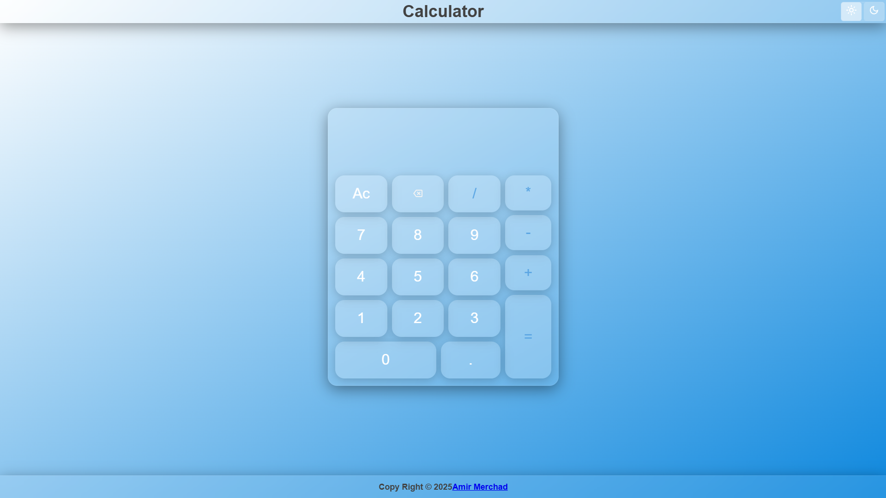
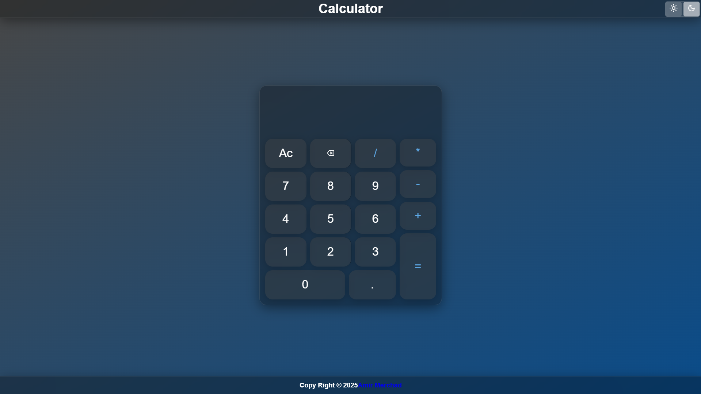

# 🧮 Calculator App

[](https://developer.mozilla.org/en-US/docs/Web/HTML)  [](https://developer.mozilla.org/en-US/docs/Web/CSS)  [](https://developer.mozilla.org/en-US/docs/Web/JavaScript)   [](https://github.com/Amir-Merchad/Calculator)

A fully functional calculator built with HTML, CSS, and JavaScript. Handles basic arithmetic operations with keyboard and click support.

Built as part of [The Odin Project](https://www.theodinproject.com/) curriculum.

<p align="left">
  
  
</p>

## 🔍 Features

- Add, subtract, multiply, divide
- Decimal support
- Clear and backspace functions
- Keyboard input support
- Clean responsive layout
- Prevents divide-by-zero errors

## 🚀 Live Demo

[🔗 View Site](https://amir-merchad.github.io/Calculator/)

## 🛠️ Technologies Used

| Tech              | Version | Notes                                       |
|-------------------|---------|---------------------------------------------|
| HTML              | 5       | Button layout and display panel             |
| CSS               | 3       | Grid layout, custom button styles           |
| JavaScript        | ES6     | Event listeners, modular logic, closures    |
| DOM API           | Web API | UI updates, keyboard support                |
| Git / GitHub/ WSl | CLI     | Version control and repo hosting            |
| WebStorm          | 2025    | Code editor                                 |
| Chrome/ Brave     | 125+    | DevTools used for testing/debugging         |

## 📁 Project Structure

~~~plaintext
calculator-app/
├── index.html
├── style.css
├── script.js
├── README.md
└── images/
    ├── img.png
    └── img1.png
~~~

## 🧠 What I Learned

- Handling user input from both mouse and keyboard
- Managing app state and edge cases
- DOM events and dynamic display updates
- Clean structuring of logic vs UI code
- Dealing with floating point quirks (0.1 + 0.2 ≠ 0.3...)

## 🧪 How to Run Locally

```bash
git clone https://github.com/yourusername/calculator-app.git
cd calculator-app
open index.html
